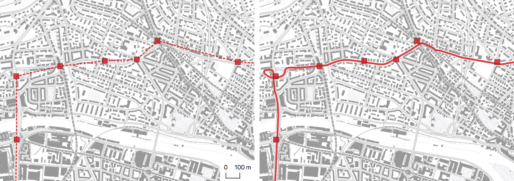
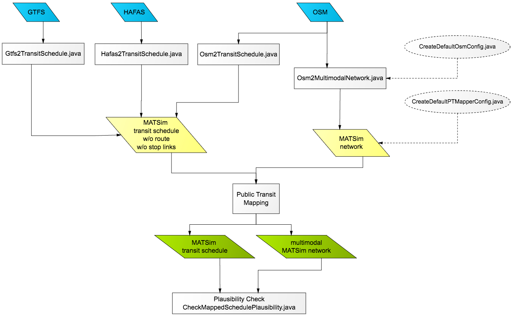

# PT2MATSim

PT2MATSim is a package to convert public transit data from GTFS, HAFAS or OSM to a completely mapped MATSim schedule.

There are multiple public transit schedule data formats, widely used formats are GTFS and HAFAS. Numerous GTFS feeds are
publicly available (see [transitfeeds.com](https://transitfeeds.com) or [transit.land](http://www.transit.land)), otherwise 
these files have to be obtained from the public transit agency. The Swiss public transit schedule is available GTFS and HAFAS 
format via [opentransportdata.swiss](https://opentransportdata.swiss). Public transit data feeds can be converted to unmapped 
MATSim transit schedules using the classes _Gtfs2Transitschedule_ or _Hafas2TransitSchedule_. It is possible to convert public 
transit information from OpenStreetMap files (_Osm2TransitSchedule_). However, OSM currently does not contain any temporal 
information, the accuracy of the schedule data varies and is usually not sufficient to be used for simulations.

Unmapped transit schedules lack information on the links used by vehicles and only contain the stop sequence
for transit routes. Generating these links (i.e. the path a vehicle takes on a network) is called "mapping", a process
done by the _PublicTransitMapper_. It implements an [algorithm](https://github.com/matsim-org/pt2matsim/wiki/Mapping-algorithm) 
that uses an abstract graph to calculate the least cost path from the transit route's first to its last stop with the constraint 
that the path must contain a so called link candidate for every stop. The result is a mapped transit schedule and a modified network.

Tools to validate and rudimentarily edit the mapped schedule are also part of the package.

### Package Workflow

[The wiki contains information on how to run the converters and mappers.](https://github.com/matsim-org/pt2matsim/wiki)

### Binaries

Releases are available on Bintray: https://bintray.com/polettif/matsim/pt2matsim. Run the _-shaded.jar_ for standalone usage.

To include pt2matsim in your own maven project, add this snippet to your pom.xml:

    <repositories>
        <repository>
            <id>pt2matsim</id>
            <url>http://dl.bintray.com/polettif/matsim</url>
        </repository>
    </repositories>

    <dependencies>
        <dependency>
            <groupId>org.matsim</groupId>
            <artifactId>pt2matsim</artifactId>
            <version>18.12</version>
        </dependency>
    </dependencies>

The master branch contains the snapshot version with the latest changes. Clone the git repository to use it.
